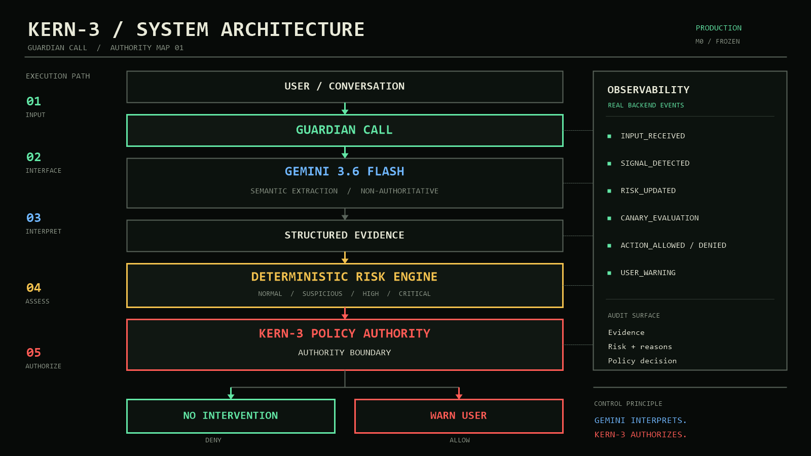
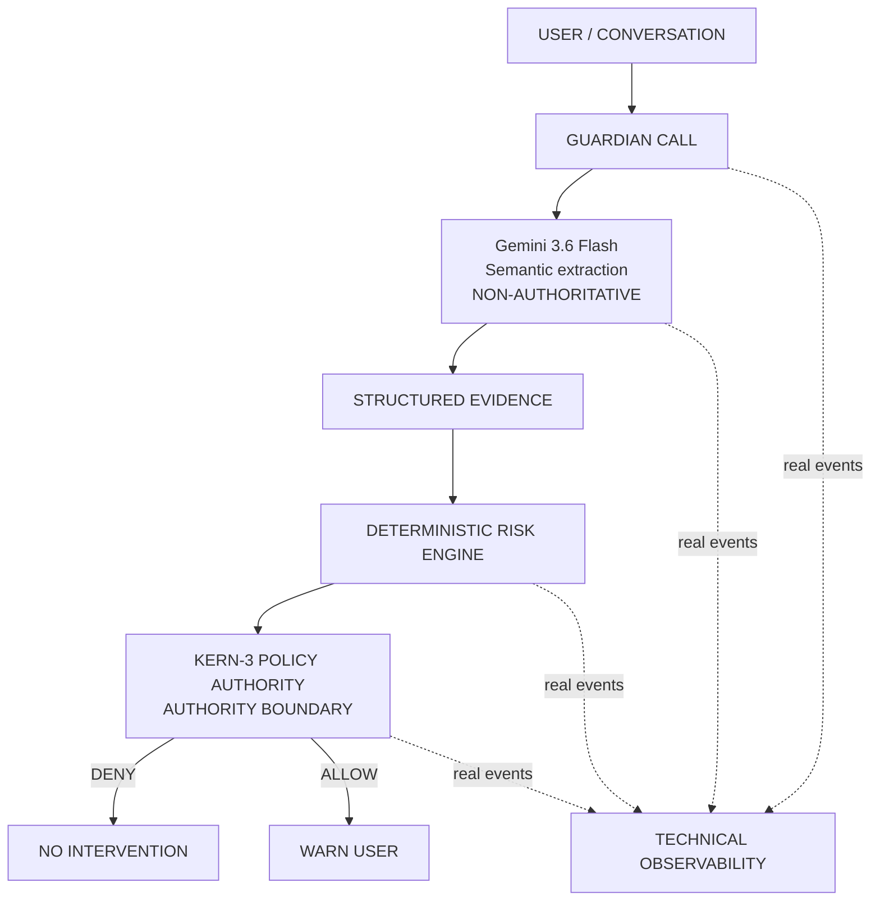

# GUARDIAN CALL / KERN-3

> Conversation-risk analysis with an explicit, deterministic authority boundary.

Guardian Call extracts structured scam evidence from conversation text, assesses risk with deterministic rules, and permits a user warning only when KERN-3 authorizes it.

`PRODUCTION` / `OBSERVABILITY` / `DETERMINISTIC AUTHORITY`

---

## SYSTEM STATUS

| Release signal | Frozen state |
|---|---|
| Build | Hackathon release |
| Semantic model | Gemini 3.6 Flash |
| Provider SDK | Google GenAI SDK |
| Runtime | Google Cloud Run |
| Regression gate | **331 PASS** |
| Primary Guardian flow | Single-turn text analysis |

The regression count measures software behavior and contract coverage. It is not a model-accuracy, precision, recall, or production-reliability metric.

## WHY GUARDIAN

Scam calls often succeed through manipulation rather than technical compromise: urgency, false authority, secrecy, and requests for credentials or one-time codes. Guardian Call makes those signals visible before they become an irreversible action.

The prototype deliberately separates language interpretation from intervention authority. A model can identify what is being requested; it cannot decide what the system is allowed to do.

## ARCHITECTURE

### KERN-3 / SYSTEM ARCHITECTURE



Gemini converts conversation language into structured evidence. The deterministic `RiskEngine` calculates an explainable qualitative risk level. KERN-3 evaluates policy at the authority boundary before any warning action can execute.



## AUTHORITY MODEL

| Layer | Responsibility | Authority |
|---|---|---|
| Gemini 3.6 Flash | Interpret language and extract fixed-schema facts | **NON-AUTHORITATIVE** |
| Structured evidence | Carry explicit scam-related signals | Data contract only |
| `RiskEngine` | Calculate risk and explain contributing reasons | **DETERMINISTIC ASSESSMENT** |
| KERN-3 | Allow or deny consequential actions under policy | **AUTHORITY BOUNDARY** |
| Action layer | Execute only an authorized warning | No independent authority |

**Gemini interprets. Gemini does not authorize intervention.** Extraction failure stops the pipeline; it is never converted into a safe verdict.

KERN-3 is implemented internally by `CanaryPolicy`. Compatibility-sensitive contracts retain `canary_decision` and `CANARY_EVALUATION`; these are implementation identifiers, not current public branding.

## SAFETY PRINCIPLES

> **KNOWLEDGE IS NOT AUTHENTICATION.**

> **TRUST DOES NOT CANCEL DANGEROUS BEHAVIOR.**

> **SENSITIVE REQUESTS OUTWEIGH APPARENT LEGITIMACY.**

Risk remains explainable through explicit signals and reasons. Consequential behavior cannot bypass policy authorization, and a denied action does not execute.

## EXAMPLE BEHAVIOR

```text
BENIGN CONVERSATION
  -> structured evidence: no manipulation signal
  -> risk: NORMAL
  -> KERN-3: warn_user DENY
  -> no intervention
```

```text
UNVERIFIED BANK CALLER REQUESTS AN OTP
  -> structured evidence: identity claim + financial context + OTP request
  -> risk: CRITICAL
  -> KERN-3: warn_user ALLOW
  -> USER_WARNING
```

## LIVE SYSTEM

| Surface | Production URL |
|---|---|
| Guardian | [guardian-stable / guardian](https://guardian-stable-jwydm7w7cq-ew.a.run.app/guardian/) |
| Technical Visualizer | [guardian-stable / visualizer](https://guardian-stable-jwydm7w7cq-ew.a.run.app/visualizer/) |
| Health | [guardian-stable / health](https://guardian-stable-jwydm7w7cq-ew.a.run.app/health) |

The primary text endpoint is `POST /api/v1/analyze`. The bounded browser voice flow submits audio to `POST /api/v1/experimental/stt`, then sends the returned transcript through the same canonical text endpoint. The technical visualizer exposes real response fields and backend events.

## TECH STACK

| Area | Technology |
|---|---|
| API and domain logic | Python, FastAPI, Pydantic |
| Semantic extraction | Google GenAI SDK, Gemini 3.6 Flash |
| User and observability interfaces | Vanilla JavaScript, Canvas 2D, HTML, CSS |
| Event transport | Server-Sent Events |
| Packaging and runtime | Docker, Google Cloud Run |

Guardian Call remains a modular monolith: one deployable service with explicit extraction, risk, policy, action, and observability boundaries.

## REPRODUCIBLE TESTING / QUICK START

```bash
python -m venv .venv
# Activate the environment for your shell.
pip install -r requirements.txt
python -m uvicorn backend.server:app --host 127.0.0.1 --port 8080
```

Set `GEMINI_API_KEY` in the process environment before provider-backed analysis. Never place credentials in repository files. Open `http://127.0.0.1:8080/guardian/` after the server starts.

Run the complete regression suite:

```bash
python -m unittest discover -s tests
```

`REGRESSION: 331 PASS`

## LIMITATIONS

- The primary Guardian analysis is single-turn.
- Browser microphone speech-to-text is experimental.
- Guardian Call does not intercept telephone calls or provide production telephony integration.
- The prototype does not authenticate callers or claim speaker authentication.
- Regression tests measure software behavior and contracts, not detection accuracy.
- Experimental V2 session state is process-local and in memory.
- There is no production persistence or Trusted Circle delivery.

## PRIVACY / SAFETY

Provider-backed conversation text and controlled demo audio are processed through Gemini cloud APIs. The Gemini credential is supplied to the deployed service at runtime and is never exposed to the browser.

The system uses synthetic evaluation scenarios, minimizes authority granted to probabilistic components, and exposes reasons and canonical events for auditability. It does not share transcripts or contact third parties as part of the frozen release.

## HACKATHON

Guardian Call is an **All Things Agentic Hackathon** submission. The release demonstrates a narrow safety thesis: semantic interpretation is useful, but consequential action requires a separate deterministic authority boundary.

No open-source license has been declared. All rights remain with the repository owner.
