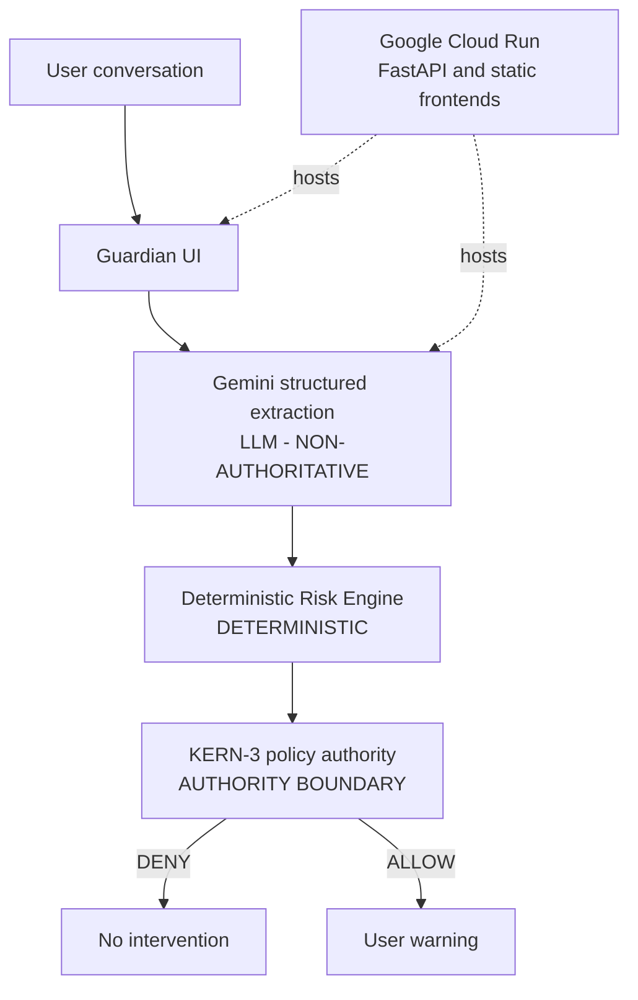

# Guardian Call

Agentic protection at the moment a conversation becomes dangerous.

Guardian Call analyzes synthetic or user-provided conversation text, extracts factual scam signals with Gemini, evaluates them with deterministic rules, and permits a warning only through the KERN-3 policy authority boundary.

## What it does

- Accepts typed text or a bounded browser microphone recording.
- Uses Gemini for structured fact extraction, never for policy decisions.
- Produces explainable qualitative risk with explicit contributing signals.
- Routes consequential warning behavior through KERN-3.
- Exposes real pipeline events in a separate technical visualizer.

## Architecture



The public name **KERN-3** maps to the policy authority layer implemented internally as `CanaryPolicy`. Compatibility-sensitive API fields and canonical events retain names such as `canary_decision` and `CANARY_EVALUATION`.

## Safety principles

> KNOWLEDGE IS NOT AUTHENTICATION.

> TRUST DOES NOT CANCEL DANGEROUS BEHAVIOR.

> SENSITIVE REQUESTS OUTWEIGH APPARENT LEGITIMACY.

Gemini extracts meaning into a fixed schema. The deterministic `RiskEngine` calculates risk and reasons. KERN-3 alone authorizes consequential actions. Extraction failure stops the pipeline; it is never converted into a safe verdict.

## Live demo

Service: [guardian-stable](https://guardian-stable-601044791798.europe-west1.run.app)

- [Guardian protected-user UI](https://guardian-stable-601044791798.europe-west1.run.app/guardian/)
- [KERN-3 technical visualizer](https://guardian-stable-601044791798.europe-west1.run.app/visualizer/)
- [Health](https://guardian-stable-601044791798.europe-west1.run.app/health)

The primary Guardian text path is `POST /api/v1/analyze`. Voice input uses `POST /api/v1/experimental/stt`, then submits the transcript through the same canonical text path. The technical visualizer also exposes the experimental multi-turn V2 endpoint; the primary Guardian flow does not use it.

## Quick start

```bash
python -m venv .venv
# Activate the environment for your shell, then:
pip install -r requirements.txt
python -m uvicorn backend.server:app --host 127.0.0.1 --port 8080
```

Set `GEMINI_API_KEY` in the process environment before provider-backed analysis. Never put credentials in repository files.

Open `http://127.0.0.1:8080/guardian/`.

## Tests

```bash
python -m unittest discover -s tests
```

The final local freeze gate passes **331 software regression tests**. This count measures code behavior and contract coverage; it is not scam-detection accuracy, precision, recall, or production reliability.

## Evaluation

The frozen M0 oracle evaluation uses 57 synthetic scenarios: 37 scam cases, 19 legitimate controls, and 1 explicitly ambiguous case. Its result is 24 passes, 10 risk mismatches, 22 model gaps, and 1 ambiguous case. These are diagnostic results against human-curated structured inputs, not live Gemini accuracy.

## Current limitations

- No caller authentication or independent speaker provenance.
- No direct phone interception or carrier integration.
- Browser microphone input is a controlled demo path.
- Conversation text and demo audio are processed through Gemini cloud APIs.
- The primary Guardian analysis is single-turn.
- Experimental V2 session state is process-local and in memory.
- No production persistence or Trusted Circle delivery.

## Repository structure

```text
backend/     FastAPI, extraction, deterministic risk, KERN-3 implementation
frontend/    Guardian protected-user UI and technical visualizer
scenarios/   Synthetic evaluation and demo cases
tests/       Unit, API, contract, and frontend tests
docs/        Architecture, evaluation, safety, deployment, and demo evidence
design/      Visual working assets
```

## Tech stack

Python, FastAPI, Pydantic, Google Gen AI SDK, vanilla JavaScript, Canvas 2D, HTML/CSS, Server-Sent Events, Docker, and Google Cloud Run.

## Hackathon

Built for the Google Cloud agentic AI hackathon. The system is intentionally a modular monolith: one deployable service, explicit authority boundaries, synthetic evaluation data, and observable decisions.

## License

No open-source license has been declared yet. All rights remain with the repository owner.
