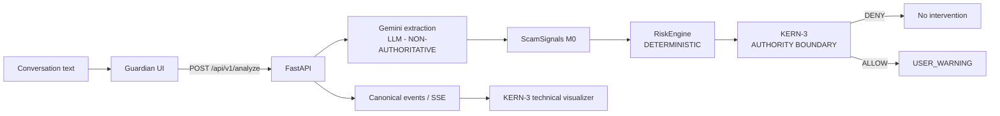

# Guardian Call Architecture

## Stable production path



Gemini performs factual structured extraction only. `RiskEngine` maps extracted signals to `NORMAL`, `SUSPICIOUS`, `HIGH`, or `CRITICAL` with explicit reasons. KERN-3 is the public name of the policy authority layer, internally implemented as `CanaryPolicy`. Warning execution requires its `ALLOW` decision.

Compatibility-sensitive internals retain `CanaryPolicy`, `CANARY_EVALUATION`, and `canary_decision`. These names are implementation contracts, not public branding.

## Primary Guardian input flows

```text
Typed text -> POST /api/v1/analyze -> M0 pipeline -> Guardian response

Browser audio -> POST /api/v1/experimental/stt -> transcript
              -> POST /api/v1/analyze -> M0 pipeline -> Guardian response
```

The primary Guardian UI is single-turn. It does not call `/api/v1/experimental/v2/turn` and does not accumulate multi-turn state.

## Technical visualizer

`/visualizer/` is a diagnostic surface. It uses the experimental V2 turn endpoint and browser STT, and displays real response fields and canonical events. The V2 session store is process-local and in memory. This experimental path does not replace the stable M0 authority model.

## Canonical event sequence

Allowed warning:

```text
INPUT_RECEIVED -> SIGNAL_DETECTED -> RISK_UPDATED
-> CANARY_EVALUATION -> ACTION_ALLOWED -> USER_WARNING
```

Denied warning:

```text
INPUT_RECEIVED -> SIGNAL_DETECTED -> RISK_UPDATED
-> CANARY_EVALUATION -> ACTION_DENIED
```

Extraction failure:

```text
INPUT_RECEIVED -> EXTRACTION_FAILED
```

Risk and policy evaluation do not run after extraction failure.

## Hosting and privacy boundary

Google Cloud Run hosts the FastAPI API and both static frontends in one service. Provider-backed text and audio leave the browser/process for Gemini processing. The prototype has no caller authentication, carrier integration, production persistence, or hardened multi-instance session store.
